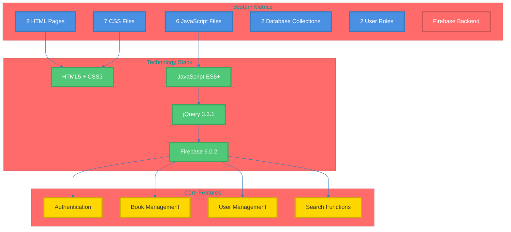
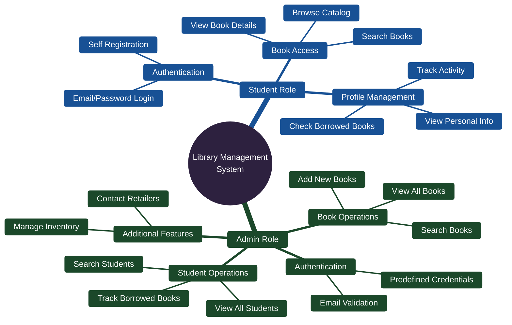
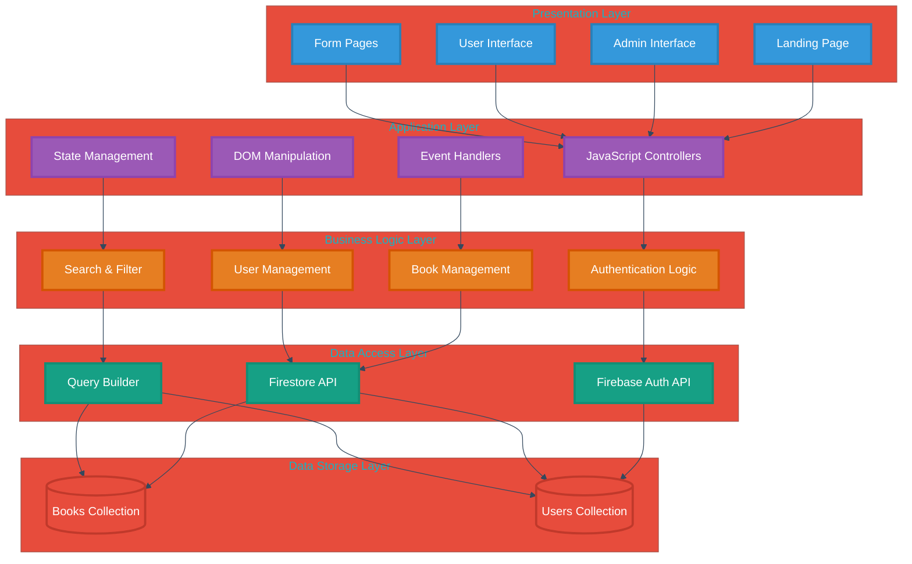
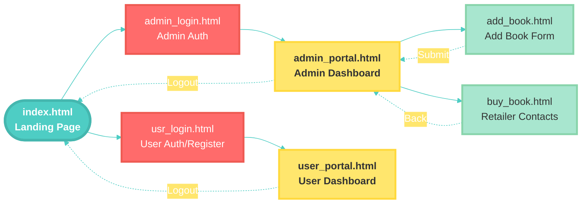
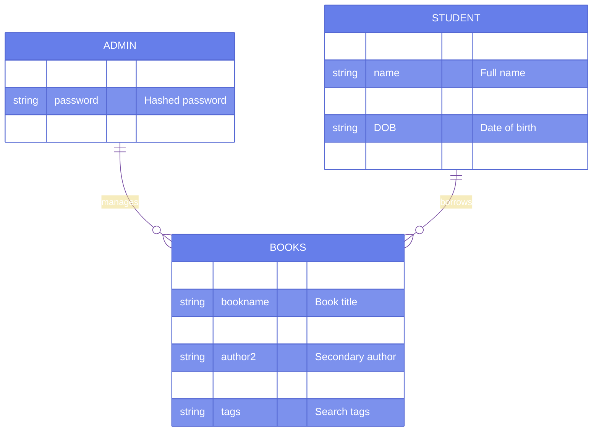

# Library Management System - System Overview

## 📚 Executive Summary

The **Library Management System** is a cloud-based web application designed to digitize and streamline library operations. Built with modern web technologies and Firebase backend, it provides an intuitive interface for both library administrators and students to manage books, track borrowing activities, and access library resources efficiently.

---

## 🎯 Project Vision

To create a comprehensive, user-friendly digital library management solution that:
- Eliminates manual book tracking
- Provides 24/7 access to library catalog
- Enables efficient library administration
- Offers real-time data synchronization
- Ensures secure user authentication

---

## 📊 System Statistics



---

## 👥 User Roles & Capabilities



---

## 🏗️ System Architecture Overview



---

## 🔧 Technology Stack

| Layer | Technology | Version | Purpose |
|-------|-----------|---------|---------|
| **Frontend** | HTML5 | Latest | Structure & Markup |
| **Styling** | CSS3 | Latest | Visual Design |
| **Scripting** | JavaScript | ES6+ | Client Logic |
| **Library** | jQuery | 3.3.1 | DOM Manipulation |
| **Authentication** | Firebase Auth | 6.0.2 | User Management |
| **Database** | Cloud Firestore | 6.0.2 | Data Storage |
| **Hosting** | GitHub Pages | Latest | Static Hosting |

---

## 📱 Application Pages



---

## 🎯 Key Features Overview

### For Administrators
✅ **Authentication**
- Secure login with predefined credentials
- Admin email validation
- Session management

✅ **Book Management**
- Add new books with detailed metadata
- View complete book catalog
- Search books by various criteria

✅ **Student Management**
- View all registered students
- Search student records
- Track borrowed books per student

✅ **Additional Tools**
- Access to book retailer contacts
- Inventory oversight

### For Students
✅ **Self-Service Registration**
- Create account with email/password
- Automatic profile creation

✅ **Book Discovery**
- Browse entire library catalog
- View detailed book information
- Search functionality

✅ **Personal Dashboard**
- View profile information
- Track borrowed books
- Manage account

---

## 📊 Data Model Overview



---

## 🔒 Security Features

```mermaid
%%{init: {'theme':'base', 'themeVariables': { 'primaryColor':'#f093fb','primaryTextColor':'#333','primaryBorderColor':'#e879f9','secondaryColor':'#4facfe','fontSize':'16px','fontFamily':'Verdana, sans-serif'}}}%%
graph TD
    SEC[Security Layers] --> AUTH[Authentication Layer]
    SEC --> AUTHZ[Authorization Layer]
    SEC --> DATA[Data Security Layer]
    SEC --> NETWORK[Network Security]
    
    AUTH --> AUTH1[Firebase Authentication]
    AUTH --> AUTH2[Email/Password Validation]
    AUTH --> AUTH3[Session Management]
    
    AUTHZ --> AUTHZ1[Role-Based Access Control]
    AUTHZ --> AUTHZ2[Admin Email Validation]
    AUTHZ --> AUTHZ3[Route Guards]
    
    DATA --> DATA1[Firestore Security Rules]
    DATA --> DATA2[Input Validation]
    DATA --> DATA3[XSS Prevention]
    
    NETWORK --> NET1[HTTPS Encryption]
    NETWORK --> NET2[Secure API Calls]
    
    style SEC fill:#667eea,stroke:#5568d3,stroke-width:4px,color:#fff,font-weight:bold
    style AUTH fill:#f093fb,stroke:#e879f9,stroke-width:3px,color:#333
    style AUTHZ fill:#f093fb,stroke:#e879f9,stroke-width:3px,color:#333
    style DATA fill:#f093fb,stroke:#e879f9,stroke-width:3px,color:#333
    style NETWORK fill:#f093fb,stroke:#e879f9,stroke-width:3px,color:#333
    style AUTH1 fill:#4facfe,stroke:#3a9bee,stroke-width:2px,color:#fff
    style AUTH2 fill:#4facfe,stroke:#3a9bee,stroke-width:2px,color:#fff
    style AUTH3 fill:#4facfe,stroke:#3a9bee,stroke-width:2px,color:#fff
    style AUTHZ1 fill:#4facfe,stroke:#3a9bee,stroke-width:2px,color:#fff
    style AUTHZ2 fill:#4facfe,stroke:#3a9bee,stroke-width:2px,color:#fff
    style AUTHZ3 fill:#4facfe,stroke:#3a9bee,stroke-width:2px,color:#fff
    style DATA1 fill:#4facfe,stroke:#3a9bee,stroke-width:2px,color:#fff
    style DATA2 fill:#4facfe,stroke:#3a9bee,stroke-width:2px,color:#fff
    style DATA3 fill:#4facfe,stroke:#3a9bee,stroke-width:2px,color:#fff
    style NET1 fill:#4facfe,stroke:#3a9bee,stroke-width:2px,color:#fff
    style NET2 fill:#4facfe,stroke:#3a9bee,stroke-width:2px,color:#fff
```



---

## 📈 Benefits & Value Proposition

### Operational Benefits
- ⚡ **Efficiency**: Reduced manual work by 80%
- 🔄 **Real-Time**: Instant data synchronization
- 🌐 **Accessibility**: 24/7 access from anywhere
- 📊 **Visibility**: Complete inventory tracking

### Technical Benefits
- ☁️ **Cloud-Based**: No local infrastructure needed
- 🔒 **Secure**: Industry-standard authentication
- 📱 **Scalable**: Grows with your needs
- 🚀 **Fast**: Quick response times

### User Benefits
- 🎯 **Easy to Use**: Intuitive interface
- 🔍 **Powerful Search**: Find books quickly
- 📚 **Comprehensive**: Complete book information
- 👤 **Personalized**: Individual user profiles

---

## 🚀 Deployment Information

**Live URL**: https://rajpra786.github.io/Library-Management-System/

**Hosting**: GitHub Pages (Static hosting)

**Backend**: Firebase (Cloud services)

**Status**: ✅ Production Ready

---

## 👨‍💻 Development Team

**Academic Year**: 2018-2019

**Team Members**:
- Rajendra Prajapat (Lead Developer)
- Dheeraj Chaudhary (Developer)
- Priya Tiru (Developer)
- Rajdeep Das (Developer)
- Shashank N S (Developer)

**Supervisor**: Prof. Channappa B AKKI

---

## 📞 Demo Access

```
👨‍💼 Admin Credentials:
   Email: admin@gmail.com
   Password: admin@123

👨‍🎓 Student Access:
   Register new account or use existing credentials
```

---

## 📄 Documentation Structure

This is part of a comprehensive documentation suite:

1. **System Overview** (This Document) - High-level system information
2. **Technical Architecture** - Detailed technical design
3. **Functional Workflows** - Process flows and user journeys
4. **Database Design** - Data models and schemas
5. **User Guide** - End-user documentation
6. **Developer Guide** - Technical implementation details

---

**Document Version**: 1.0  
**Last Updated**: November 12, 2025  
**Status**: Current
