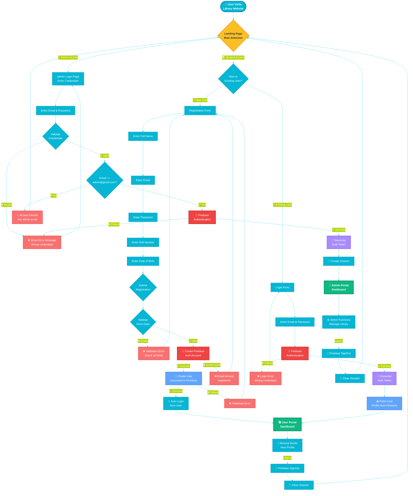
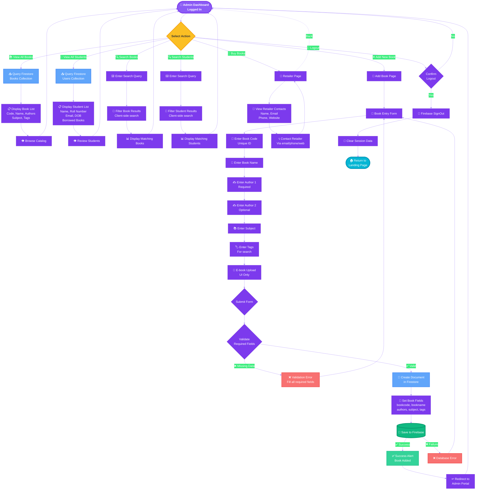
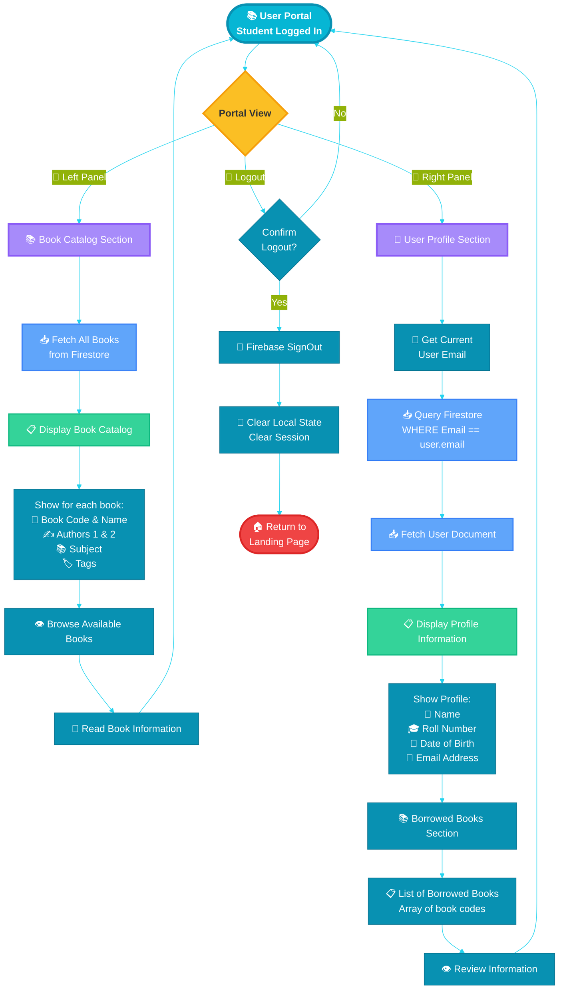

# Library Management System - Functional Workflows

## 🔄 Process Flows & User Journeys

This document details all functional workflows in the Library Management System, showing step-by-step processes for different user actions.

---

## 1️⃣ Complete User Authentication Flow



---

## 2️⃣ Admin Operations Workflow



---

## 3️⃣ User (Student) Operations Workflow



---

## 4️⃣ Book Addition Process (Detailed)

```mermaid
%%{init: {'theme':'base', 'themeVariables': { 'primaryColor':'#10b981','primaryTextColor':'#fff','primaryBorderColor':'#059669','lineColor':'#34d399','fontSize':'17px','fontFamily':'system-ui, sans-serif'}}}%%
flowchart TD
    START([➕ Admin Clicks<br/>Add Books Button]) --> NAVIGATE[🔄 Navigate to<br/>add_book.html]
    
    NAVIGATE --> PAGE_LOAD[📄 Page Loads<br/>Initialize Form]
    PAGE_LOAD --> FORM[📝 Book Entry Form<br/>Empty Fields]
    
    FORM --> STEP1[Step 1️⃣<br/>📌 Enter Book Code<br/>type: number, required]
    STEP1 --> STEP2[Step 2️⃣<br/>📖 Enter Book Name<br/>type: text, required]
    STEP2 --> STEP3[Step 3️⃣<br/>✍️ Enter Author 1<br/>type: text, required]
    STEP3 --> STEP4[Step 4️⃣<br/>✍️ Enter Author 2<br/>type: text, optional]
    STEP4 --> STEP5[Step 5️⃣<br/>📚 Enter Subject<br/>type: text, required]
    STEP5 --> STEP6[Step 6️⃣<br/>🏷️ Enter Tags<br/>type: textarea, optional]
    STEP6 --> STEP7[Step 7️⃣<br/>📁 Upload E-book<br/>UI Only - Not Functional]
    
    STEP7 --> SUBMIT{Click Submit<br/>Button}
    
    SUBMIT --> CLIENT_VAL{Client-Side<br/>Validation}
    
    CLIENT_VAL -->|❌ Missing Required| HIGHLIGHT[⚠️ Highlight Empty Fields<br/>Show Error Messages]
    HIGHLIGHT --> FORM
    
    CLIENT_VAL -->|✅ All Required Present| BUILD_OBJ[🔧 Build Book Object]
    
    BUILD_OBJ --> OBJ_STRUCT[Create JavaScript Object:<br/>{<br/>  bookcode: value,<br/>  bookname: value,<br/>  author1: value,<br/>  author2: value,<br/>  subject: value,<br/>  tags: value<br/>}]
    
    OBJ_STRUCT --> FIREBASE_CALL[🔥 Call Firebase API<br/>db.collection books<br/>.doc bookcode<br/>.set object]
    
    FIREBASE_CALL --> PROCESS{Firebase<br/>Processing}
    
    PROCESS -->|❌ Error| CHECK_ERR{Error Type}
    CHECK_ERR -->|Network Error| NET_ERR[🌐 Network Error<br/>Check connection]
    CHECK_ERR -->|Permission Denied| PERM_ERR[🔒 Permission Error<br/>Check Firebase rules]
    CHECK_ERR -->|Duplicate Code| DUP_ERR[📌 Duplicate Book Code<br/>Use unique code]
    
    NET_ERR --> ERROR_MSG[❌ Show Error Alert<br/>window.alert]
    PERM_ERR --> ERROR_MSG
    DUP_ERR --> ERROR_MSG
    ERROR_MSG --> FORM
    
    PROCESS -->|✅ Success| WRITE_SUCCESS[💾 Document Written<br/>to Firestore]
    
    WRITE_SUCCESS --> SUCCESS_LOG[📝 Log Success<br/>console.log]
    SUCCESS_LOG --> SUCCESS_ALERT[✅ Show Success Alert<br/>"Successfully Book Added"]
    
    SUCCESS_ALERT --> REDIRECT_WAIT[⏳ Wait 1 second]
    REDIRECT_WAIT --> REDIRECT[↩️ window.location =<br/>'admin_portal.html']
    
    REDIRECT --> PORTAL_LOAD[🏢 Admin Portal Loads]
    PORTAL_LOAD --> REFRESH[🔄 Fetch Updated<br/>Book List]
    REFRESH --> SHOW_NEW[✨ New Book Appears<br/>in Catalog]
    
    SHOW_NEW --> END([✅ Process Complete<br/>Book Added Successfully])
    
    style START fill:#10b981,stroke:#059669,stroke-width:4px,color:#fff,font-weight:bold
    style FORM fill:#fbbf24,stroke:#f59e0b,stroke-width:3px,color:#333
    style STEP1 fill:#60a5fa,stroke:#3b82f6,stroke-width:2px,color:#fff
    style STEP2 fill:#60a5fa,stroke:#3b82f6,stroke-width:2px,color:#fff
    style STEP3 fill:#60a5fa,stroke:#3b82f6,stroke-width:2px,color:#fff
    style STEP4 fill:#93c5fd,stroke:#60a5fa,stroke-width:2px,color:#333
    style STEP5 fill:#60a5fa,stroke:#3b82f6,stroke-width:2px,color:#fff
    style STEP6 fill:#93c5fd,stroke:#60a5fa,stroke-width:2px,color:#333
    style STEP7 fill:#cbd5e1,stroke:#94a3b8,stroke-width:2px,color:#333
    style FIREBASE_CALL fill:#ef4444,stroke:#dc2626,stroke-width:3px,color:#fff,font-weight:bold
    style WRITE_SUCCESS fill:#34d399,stroke:#10b981,stroke-width:3px,color:#fff
    style ERROR_MSG fill:#f87171,stroke:#ef4444,stroke-width:2px,color:#fff
    style NET_ERR fill:#fca5a5,stroke:#f87171,stroke-width:2px,color:#333
    style PERM_ERR fill:#fca5a5,stroke:#f87171,stroke-width:2px,color:#333
    style DUP_ERR fill:#fca5a5,stroke:#f87171,stroke-width:2px,color:#333
    style SUCCESS_ALERT fill:#86efac,stroke:#34d399,stroke-width:2px,color:#333
    style END fill:#10b981,stroke:#059669,stroke-width:4px,color:#fff,font-weight:bold
```

---

## 5️⃣ User Registration Complete Flow

```mermaid
%%{init: {'theme':'base', 'themeVariables': { 'primaryColor':'#f59e0b','primaryTextColor':'#fff','primaryBorderColor':'#d97706','lineColor':'#fbbf24','fontSize':'17px','fontFamily':'Helvetica Neue, Arial'}}}%%
flowchart TD
    START([📝 New User<br/>Clicks Register]) --> REG_PAGE[📄 Registration Page Loads<br/>usr_login.html]
    
    REG_PAGE --> FORM[📋 Registration Form<br/>Empty Fields]
    
    FORM --> F1[Field 1:<br/>👤 Enter Full Name<br/>type: text, required]
    F1 --> F2[Field 2:<br/>📧 Enter Email<br/>type: email, required]
    F2 --> F3[Field 3:<br/>🔒 Enter Password<br/>type: password, required]
    F3 --> F4[Field 4:<br/>🎓 Enter Roll Number<br/>type: text, required]
    F4 --> F5[Field 5:<br/>📅 Enter Date of Birth<br/>type: date, required]
    
    F5 --> SUBMIT{Click<br/>Register Button}
    
    SUBMIT --> VALIDATE{Validate<br/>All Fields}
    
    VALIDATE -->|❌ Missing/Invalid| SHOW_ERR[⚠️ Show Validation Errors<br/>Highlight invalid fields]
    SHOW_ERR --> FORM
    
    VALIDATE -->|✅ Valid| BUILD_USER[🔧 Build User Object]
    
    BUILD_USER --> USER_OBJ[Create Objects:<br/>Auth: {email, password}<br/>Profile: {name, email,<br/>Roll_Number, DOB,<br/>books: empty array}]
    
    USER_OBJ --> CREATE_AUTH[🔥 Firebase Auth API<br/>createUserWithEmailAndPassword<br/>email, password]
    
    CREATE_AUTH --> AUTH_CHECK{Authentication<br/>Result}
    
    AUTH_CHECK -->|❌ Error| AUTH_ERR_TYPE{Error Type}
    AUTH_ERR_TYPE -->|Email Exists| EMAIL_ERR[📧 Email Already Registered<br/>Use different email]
    AUTH_ERR_TYPE -->|Weak Password| PASS_ERR[🔒 Password Too Weak<br/>Use stronger password]
    AUTH_ERR_TYPE -->|Other| OTHER_ERR[❌ Authentication Error]
    
    EMAIL_ERR --> ERR_ALERT[❌ window.alert<br/>Show error message]
    PASS_ERR --> ERR_ALERT
    OTHER_ERR --> ERR_ALERT
    ERR_ALERT --> FORM
    
    AUTH_CHECK -->|✅ Success| AUTH_SUCCESS[✅ Auth Account Created<br/>User ID generated]
    
    AUTH_SUCCESS --> CREATE_DOC[💾 Create Firestore Document<br/>Collection: users<br/>Doc ID: Roll_Number]
    
    CREATE_DOC --> SET_PROFILE[📝 Set Document Fields<br/>name, Email, Roll_Number,<br/>DOB, books array]
    
    SET_PROFILE --> SAVE_DB[(💾 Save to Firestore)]
    
    SAVE_DB -->|❌ Error| DB_ERR[❌ Database Save Error<br/>Profile not created]
    DB_ERR --> ERR_ALERT
    
    SAVE_DB -->|✅ Success| DB_SUCCESS[✅ Profile Created<br/>Document written]
    
    DB_SUCCESS --> AUTO_LOGIN[🎫 Auto Login<br/>User already authenticated]
    
    AUTO_LOGIN --> CREATE_SESSION[📝 Create Session<br/>Store auth state]
    
    CREATE_SESSION --> REDIRECT[↩️ Redirect to<br/>user_portal.html]
    
    REDIRECT --> LOAD_PORTAL[📚 User Portal Loads]
    
    LOAD_PORTAL --> FETCH_PROFILE[📥 Fetch User Profile<br/>from Firestore]
    
    FETCH_PROFILE --> FETCH_BOOKS[📥 Fetch All Books<br/>for catalog]
    
    FETCH_BOOKS --> RENDER[🎨 Render Dashboard<br/>Profile + Books]
    
    RENDER --> END([✅ Registration Complete<br/>User Logged In])
    
    style START fill:#f59e0b,stroke:#d97706,stroke-width:4px,color:#fff,font-weight:bold
    style FORM fill:#fbbf24,stroke:#f59e0b,stroke-width:3px,color:#333
    style F1 fill:#60a5fa,stroke:#3b82f6,stroke-width:2px,color:#fff
    style F2 fill:#60a5fa,stroke:#3b82f6,stroke-width:2px,color:#fff
    style F3 fill:#60a5fa,stroke:#3b82f6,stroke-width:2px,color:#fff
    style F4 fill:#60a5fa,stroke:#3b82f6,stroke-width:2px,color:#fff
    style F5 fill:#60a5fa,stroke:#3b82f6,stroke-width:2px,color:#fff
    style CREATE_AUTH fill:#ef4444,stroke:#dc2626,stroke-width:3px,color:#fff,font-weight:bold
    style CREATE_DOC fill:#10b981,stroke:#059669,stroke-width:3px,color:#fff
    style SAVE_DB fill:#10b981,stroke:#059669,stroke-width:3px,color:#fff
    style AUTH_SUCCESS fill:#34d399,stroke:#10b981,stroke-width:2px,color:#fff
    style DB_SUCCESS fill:#34d399,stroke:#10b981,stroke-width:2px,color:#fff
    style ERR_ALERT fill:#f87171,stroke:#ef4444,stroke-width:2px,color:#fff
    style EMAIL_ERR fill:#fca5a5,stroke:#f87171,stroke-width:2px,color:#333
    style PASS_ERR fill:#fca5a5,stroke:#f87171,stroke-width:2px,color:#333
    style OTHER_ERR fill:#fca5a5,stroke:#f87171,stroke-width:2px,color:#333
    style DB_ERR fill:#fca5a5,stroke:#f87171,stroke-width:2px,color:#333
    style END fill:#10b981,stroke:#059669,stroke-width:4px,color:#fff,font-weight:bold
```

---

## 6️⃣ System Data Flow Overview

```mermaid
%%{init: {'theme':'base', 'themeVariables': { 'primaryColor':'#6366f1','primaryTextColor':'#fff','primaryBorderColor':'#4f46e5','lineColor':'#818cf8','fontSize':'17px','fontFamily':'Inter, system-ui'}}}%%
graph LR
    subgraph "👥 Users"
        ADMIN[🏢 Admin User]
        STUDENT[🎓 Student User]
    end
    
    subgraph "🖥️ Client Layer"
        BROWSER[🌐 Web Browser]
        UI[🎨 HTML/CSS Interface]
    end
    
    subgraph "⚙️ Application Logic"
        JS[📜 JavaScript Controllers]
        JQUERY[🔧 jQuery Library]
    end
    
    subgraph "🔌 API Layer"
        AUTHAPI[🔐 Firebase Auth API]
        DBAPI[💾 Firestore API]
    end
    
    subgraph "☁️ Firebase Services"
        AUTH[🔒 Authentication Service]
        FIRESTORE[💿 Firestore Database]
    end
    
    subgraph "📊 Data Storage"
        BOOKS[(📚 Books<br/>Collection)]
        USERS[(👥 Users<br/>Collection)]
    end
    
    ADMIN -->|Interact| BROWSER
    STUDENT -->|Interact| BROWSER
    
    BROWSER <-->|Render/Events| UI
    UI <-->|Updates/Events| JS
    JS <-->|DOM Manipulation| JQUERY
    
    JS <-->|Auth Requests| AUTHAPI
    JS <-->|Data Requests| DBAPI
    
    AUTHAPI <-->|Verify/Token| AUTH
    DBAPI <-->|CRUD Operations| FIRESTORE
    
    FIRESTORE <-->|Read/Write| BOOKS
    FIRESTORE <-->|Read/Write| USERS
    
    AUTH -.Validates.-> JS
    
    style ADMIN fill:#a78bfa,stroke:#8b5cf6,stroke-width:3px,color:#fff,font-weight:bold
    style STUDENT fill:#a78bfa,stroke:#8b5cf6,stroke-width:3px,color:#fff,font-weight:bold
    style BROWSER fill:#60a5fa,stroke:#3b82f6,stroke-width:3px,color:#fff
    style UI fill:#60a5fa,stroke:#3b82f6,stroke-width:3px,color:#fff
    style JS fill:#fbbf24,stroke:#f59e0b,stroke-width:3px,color:#333,font-weight:bold
    style JQUERY fill:#fbbf24,stroke:#f59e0b,stroke-width:3px,color:#333
    style AUTHAPI fill:#f97316,stroke:#ea580c,stroke-width:3px,color:#fff
    style DBAPI fill:#f97316,stroke:#ea580c,stroke-width:3px,color:#fff
    style AUTH fill:#ef4444,stroke:#dc2626,stroke-width:3px,color:#fff,font-weight:bold
    style FIRESTORE fill:#ef4444,stroke:#dc2626,stroke-width:3px,color:#fff,font-weight:bold
    style BOOKS fill:#10b981,stroke:#059669,stroke-width:3px,color:#fff
    style USERS fill:#10b981,stroke:#059669,stroke-width:3px,color:#fff
```



---

## 📝 Workflow Summary

### Key Processes Covered
1. **Complete Authentication** - Admin and User login/registration
2. **Admin Operations** - All admin dashboard functions
3. **User Operations** - Student portal features
4. **Book Addition** - Detailed step-by-step process
5. **User Registration** - Complete registration flow
6. **Data Flow** - System-wide data movement

### Process Characteristics
- ✅ **Clear Entry/Exit Points**: Every workflow has defined start and end
- 🔄 **Error Handling**: All error scenarios documented
- 🎯 **Decision Points**: Clear decision logic at each branch
- 📊 **Data Operations**: Database interactions highlighted
- 🔐 **Security Checks**: Authentication and validation steps shown

---

**Document Version**: 1.0  
**Last Updated**: November 12, 2025  
**Next Document**: Database Design & User Guide
