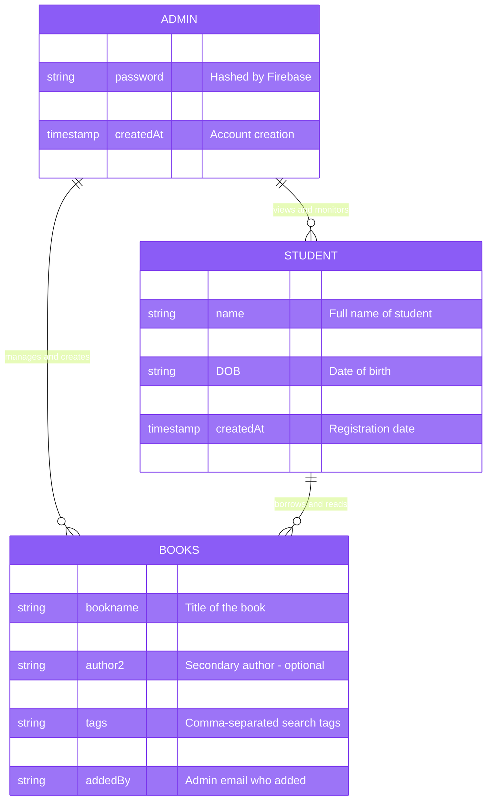
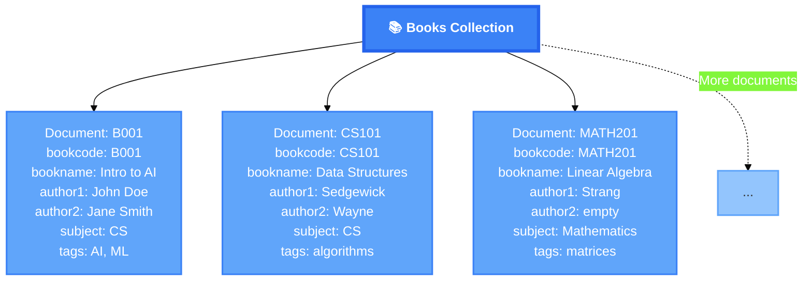
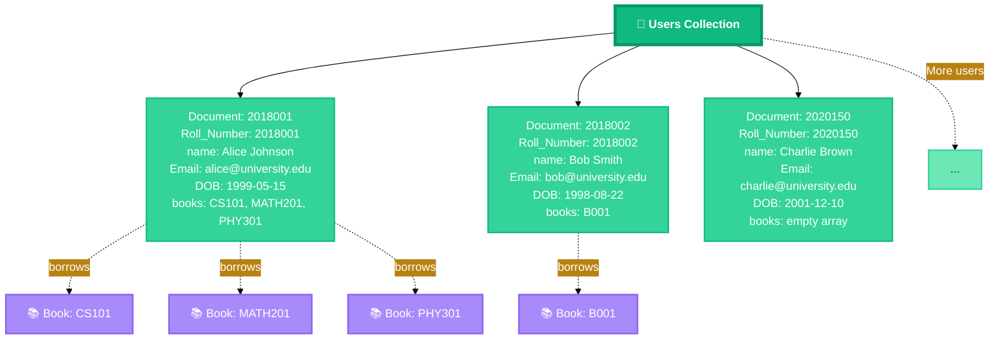
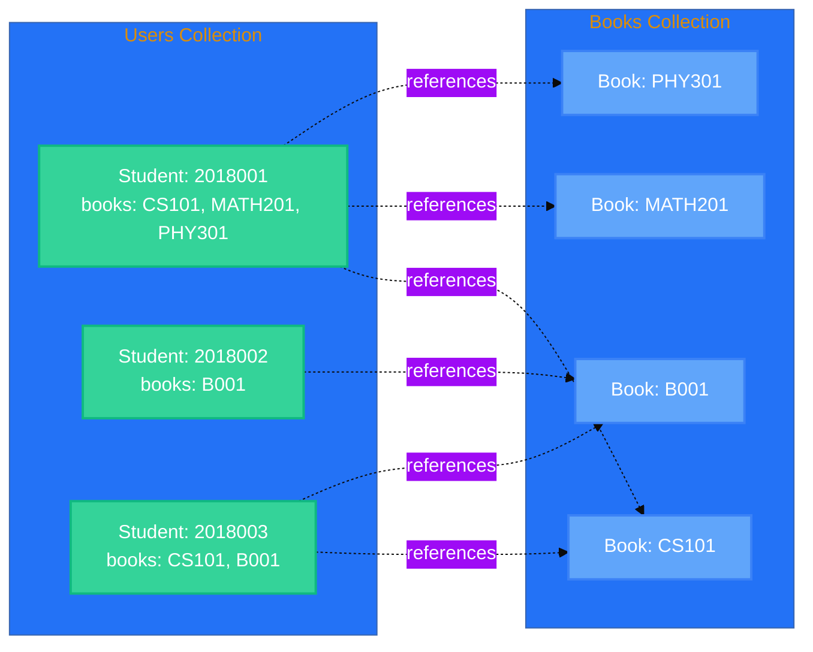
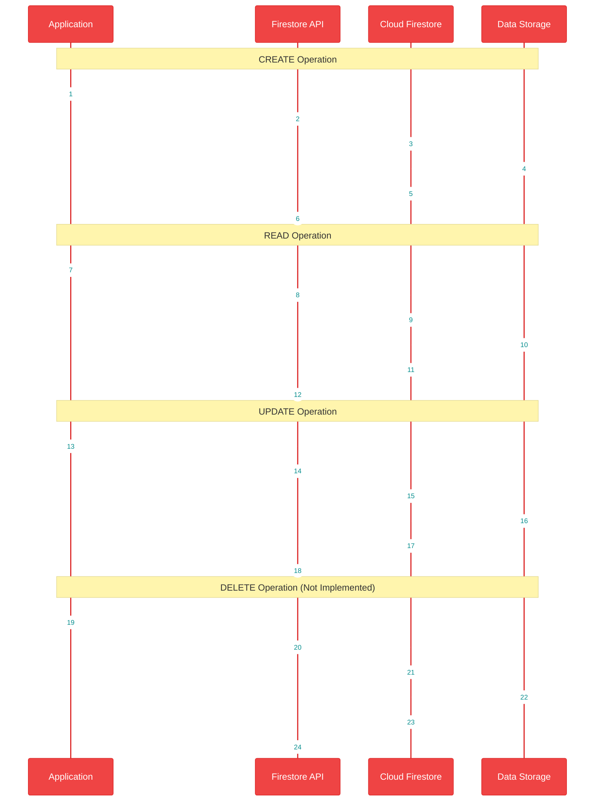
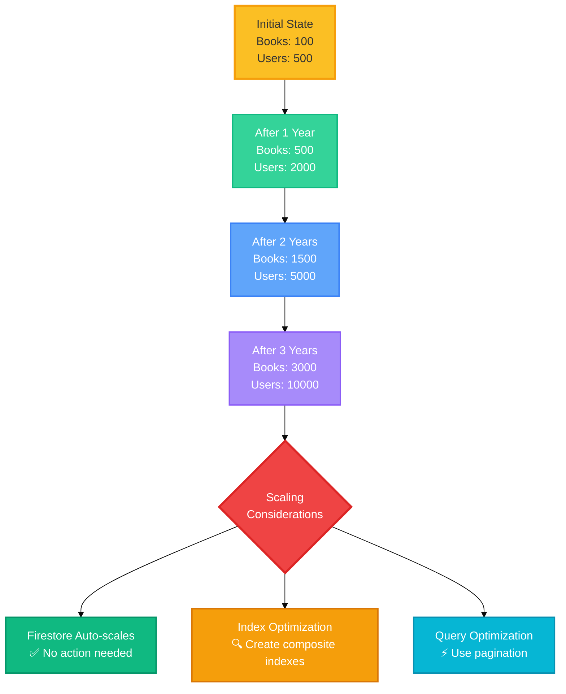

# Library Management System - Database Design

## 💾 Database Architecture & Data Models

This document provides complete details about the database design, including schemas, relationships, and data structures used in the Library Management System.

---

## 🏗️ Database Platform

**Database Type**: Cloud Firestore (NoSQL Document Database)

**Provider**: Google Firebase

**Version**: 6.0.2

**Database URL**: `https://library-management-syste-f2a85.firebaseio.com`

---

## 📊 Entity Relationship Diagram



---

## 📚 Collection: Books

### Document Structure

```javascript
{
  // Document ID = bookcode (e.g., "B001", "CS101")
  bookcode: "B001",                    // Type: string, Primary Key
  bookname: "Introduction to AI",      // Type: string, Required
  author1: "John Doe",                 // Type: string, Required
  author2: "Jane Smith",               // Type: string, Optional
  subject: "Computer Science",         // Type: string, Required
  tags: "AI, ML, CS, Technology"       // Type: string, Optional
}
```

### Field Specifications

| Field | Type | Required | Constraints | Description |
|-------|------|----------|-------------|-------------|
| **bookcode** | string | ✅ Yes | Unique, PK | Unique identifier for the book |
| **bookname** | string | ✅ Yes | 1-500 chars | Full title of the book |
| **author1** | string | ✅ Yes | 1-200 chars | Primary author name |
| **author2** | string | ❌ No | 1-200 chars | Secondary author (optional) |
| **subject** | string | ✅ Yes | 1-100 chars | Subject/category of book |
| **tags** | string | ❌ No | Max 500 chars | Comma-separated keywords for search |

### Example Documents

```javascript
// Example 1: Computer Science Book
{
  bookcode: "CS101",
  bookname: "Data Structures and Algorithms",
  author1: "Robert Sedgewick",
  author2: "Kevin Wayne",
  subject: "Computer Science",
  tags: "algorithms, data structures, programming, java"
}

// Example 2: Mathematics Book
{
  bookcode: "MATH201",
  bookname: "Linear Algebra",
  author1: "Gilbert Strang",
  author2: "",
  subject: "Mathematics",
  tags: "linear algebra, matrices, vectors"
}

// Example 3: Physics Book
{
  bookcode: "PHY301",
  bookname: "Quantum Mechanics",
  author1: "Richard Feynman",
  author2: "Albert Hibbs",
  subject: "Physics",
  tags: "quantum, physics, mechanics, theory"
}
```

### Collection Visualization



---

## 👥 Collection: Users

### Document Structure

```javascript
{
  // Document ID = Roll_Number (e.g., "2018001", "STU12345")
  Roll_Number: "2018001",              // Type: string, Primary Key
  name: "Alice Johnson",               // Type: string, Required
  Email: "alice@example.com",          // Type: string, Required, Unique
  DOB: "1999-05-15",                  // Type: string (YYYY-MM-DD), Required
  books: ["B001", "CS101", "MATH201"]  // Type: array of strings, Optional
}
```

### Field Specifications

| Field | Type | Required | Constraints | Description |
|-------|------|----------|-------------|-------------|
| **Roll_Number** | string | ✅ Yes | Unique, PK | Student's roll/ID number |
| **name** | string | ✅ Yes | 1-200 chars | Full name of student |
| **Email** | string | ✅ Yes | Valid email, Unique | Email for authentication |
| **DOB** | string | ✅ Yes | Date format | Date of birth |
| **books** | array | ❌ No | Array of strings | List of borrowed book codes |

### Example Documents

```javascript
// Example 1: Student with multiple borrowed books
{
  Roll_Number: "2018001",
  name: "Alice Johnson",
  Email: "alice.johnson@university.edu",
  DOB: "1999-05-15",
  books: ["CS101", "MATH201", "PHY301"]
}

// Example 2: Student with one borrowed book
{
  Roll_Number: "2018002",
  name: "Bob Smith",
  Email: "bob.smith@university.edu",
  DOB: "1998-08-22",
  books: ["B001"]
}

// Example 3: New student with no borrowed books
{
  Roll_Number: "2020150",
  name: "Charlie Brown",
  Email: "charlie.brown@university.edu",
  DOB: "2001-12-10",
  books: []
}
```

### Collection Visualization



---

## 🔗 Data Relationships

### Books ↔ Users Relationship



**Relationship Type**: One-to-Many (Tracked via Array)

**Implementation**: 
- Users collection stores array of book codes
- No foreign key constraints (NoSQL)
- Application enforces referential integrity
- Array can contain multiple book codes

---

## 🔍 Query Patterns

### Common Queries

#### 1. Fetch All Books
```javascript
db.collection("books")
  .get()
  .then(function(querySnapshot) {
    querySnapshot.forEach(function(doc) {
      console.log(doc.id, " => ", doc.data());
    });
  });
```

#### 2. Fetch Specific Book by Code
```javascript
db.collection("books")
  .doc("CS101")
  .get()
  .then(function(doc) {
    if (doc.exists) {
      console.log("Book data:", doc.data());
    }
  });
```

#### 3. Search Books by Subject
```javascript
db.collection("books")
  .where("subject", "==", "Computer Science")
  .get()
  .then(function(querySnapshot) {
    querySnapshot.forEach(function(doc) {
      console.log(doc.data());
    });
  });
```

#### 4. Fetch User by Email
```javascript
db.collection("users")
  .where("Email", "==", "alice@university.edu")
  .get()
  .then(function(querySnapshot) {
    querySnapshot.forEach(function(doc) {
      console.log("User:", doc.data());
    });
  });
```

#### 5. Fetch All Users
```javascript
db.collection("users")
  .get()
  .then(function(querySnapshot) {
    querySnapshot.forEach(function(doc) {
      console.log(doc.data());
    });
  });
```

---

## 💾 Data Operations Flow



---

## 🔐 Security Rules

### Current Firestore Rules (Conceptual)

```javascript
rules_version = '2';
service cloud.firestore {
  match /databases/{database}/documents {
    
    // Books Collection
    match /books/{bookId} {
      // Allow read access to all authenticated users
      allow read: if request.auth != null;
      
      // Allow write only to admin
      allow write: if request.auth != null 
                   && request.auth.token.email == 'admin@gmail.com';
    }
    
    // Users Collection
    match /users/{userId} {
      // Allow users to read their own data
      allow read: if request.auth != null 
                  && request.auth.token.email == resource.data.Email;
      
      // Allow admin to read all users
      allow read: if request.auth != null 
                  && request.auth.token.email == 'admin@gmail.com';
      
      // Allow users to update their own data
      allow update: if request.auth != null 
                    && request.auth.token.email == resource.data.Email;
      
      // Allow write for registration
      allow create: if request.auth != null;
    }
  }
}
```

---

## 📈 Data Growth Projections

### Scalability Considerations



### Storage Estimates

| Entity | Avg Size | 1000 Records | 10000 Records |
|--------|----------|--------------|---------------|
| **Book Document** | ~500 bytes | ~500 KB | ~5 MB |
| **User Document** | ~300 bytes | ~300 KB | ~3 MB |
| **Total (Mixed)** | - | ~800 KB | ~8 MB |

**Note**: Firestore scales automatically and pricing is based on reads/writes, not storage.

---

## 🔄 Backup & Recovery

### Firestore Automatic Features
- **Point-in-time Recovery**: Restore to any point in last 7 days
- **Multi-region Replication**: Automatic data replication
- **Automatic Backups**: Managed by Firebase
- **Export/Import**: Manual export for long-term backup

### Backup Strategy
1. **Firebase Console**: Use built-in export features
2. **Cloud Scheduler**: Automated exports to Cloud Storage
3. **Version Control**: Document structure changes in Git

---

## 📊 Database Statistics

### Current Implementation
- **Collections**: 2 (Books, Users)
- **Indexes**: Auto-generated by Firestore
- **Security Rules**: Configured for role-based access
- **Regions**: Multi-region by default
- **Replication**: Automatic

### Performance Metrics
- **Read Latency**: < 100ms (average)
- **Write Latency**: < 200ms (average)
- **Concurrent Users**: Scales automatically
- **Query Performance**: Optimized by Firestore indexes

---

## 🎯 Best Practices Implemented

✅ **Document ID Strategy**: Using meaningful IDs (bookcode, Roll_Number)

✅ **Data Denormalization**: Storing book codes in users array for quick access

✅ **Flat Structure**: Avoiding deep nesting for better performance

✅ **Required Fields**: Enforcing required fields at application level

✅ **Email Uniqueness**: Ensured through Firebase Authentication

✅ **Array Usage**: Using arrays for one-to-many relationships

---

**Document Version**: 1.0  
**Last Updated**: November 12, 2025  
**Next Document**: User Guide & Developer Reference
