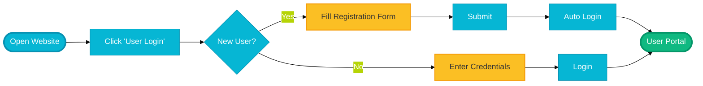
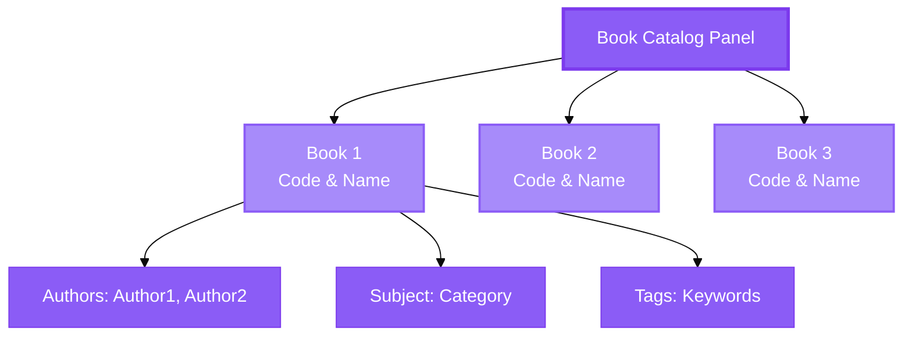
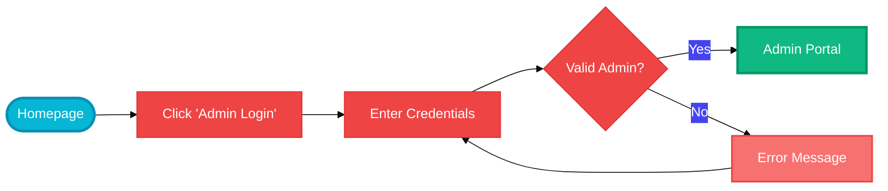
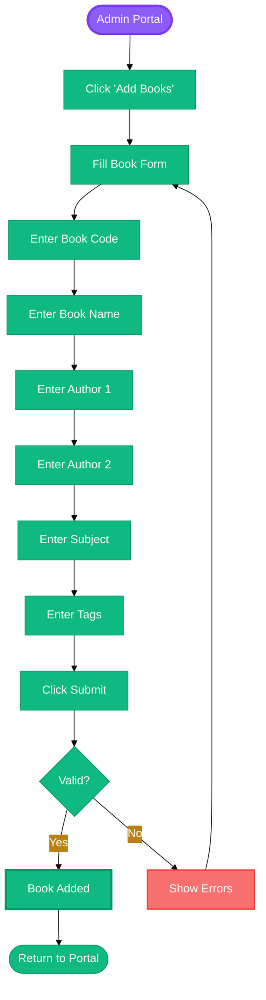

# Library Management System - User Guide

## 📖 Complete User Manual

This guide provides step-by-step instructions for using the Library Management System, designed for both end-users (students) and administrators.

---

## 🚀 Getting Started

### Accessing the System

**Live URL**: https://rajpra786.github.io/Library-Management-System/

**Supported Browsers**:
- ✅ Google Chrome (Recommended)
- ✅ Mozilla Firefox
- ✅ Microsoft Edge
- ✅ Safari
- ❌ Internet Explorer (Not supported)

**Prerequisites**:
- Active internet connection
- JavaScript enabled in browser
- Valid email address (for user registration)

---

## 👤 For Students/Users

### 1. New User Registration



**Step-by-Step Instructions**:

**Step 1**: Visit the website homepage  
- You'll see two options: "Admin Login" and "User Login"

**Step 2**: Click on **"User Login"** button  
- This takes you to the login/registration page

**Step 3**: Fill Registration Form  
Enter the following information:
- **Full Name**: Your complete name
- **Email**: Your valid email address (will be used for login)
- **Password**: Choose a strong password (min. 6 characters)
- **Roll Number**: Your student/ID number (must be unique)
- **Date of Birth**: Select from date picker

**Step 4**: Click **"Register"** button  
- System will create your account
- If email already exists, you'll see an error message
- If successful, you'll be automatically logged in

**Step 5**: Access Your Dashboard  
- You're now in your personal User Portal
- You can browse books and view your profile

### 2. User Login (Existing Users)

**Step 1**: Click "User Login" on homepage

**Step 2**: Enter your credentials:
- Email address (used during registration)
- Password

**Step 3**: Click "Login" button
- If credentials are correct, you'll access your portal
- If incorrect, you'll see an error message

### 3. Browsing Book Catalog

Once logged in, you'll see two panels:

**📚 Left Panel - Book Catalog**



Each book displays:
- 📌 **Book Code** and **Book Name**
- ✍️ **Authors** (Primary and Secondary)
- 📚 **Subject** category
- 🏷️ **Tags** for search keywords

**Usage**:
- Scroll through the list to browse available books
- Read details about each book
- Note the book code if you want to borrow (request via librarian)

### 4. Viewing Your Profile

**👤 Right Panel - User Profile**

Displays your personal information:
- 👤 **Name**: Your full name
- 🎓 **Roll Number**: Your student ID
- 📧 **Email**: Your registered email
- 📅 **Date of Birth**: Your DOB
- 📚 **Borrowed Books**: List of books you've borrowed

**Usage**:
- Review your personal information
- Check which books you currently have borrowed
- Verify your details are correct

### 5. Logging Out

**Step 1**: Click the **"Logout"** button (top of the page)

**Step 2**: Confirm logout
- Your session will be ended
- You'll be redirected to the homepage

**Security Tip**: Always logout when using shared computers!

---

## 👨‍💼 For Administrators

### 1. Admin Login



**Default Admin Credentials**:
```
Email: admin@gmail.com
Password: admin@123
```

**Step-by-Step**:

**Step 1**: Click **"Admin Login"** on homepage

**Step 2**: Enter admin credentials
- Email: `admin@gmail.com`
- Password: `admin@123`

**Step 3**: Click "Login" button
- System validates you're the admin
- Redirects to Admin Portal

**Important**: Only the email `admin@gmail.com` has admin access!

### 2. Admin Dashboard Overview

The Admin Portal provides access to:
- 📚 **View All Books** - Complete catalog
- 👥 **View All Students** - All registered users
- 🔍 **Search Books** - Find specific books
- 🔍 **Search Students** - Find specific students
- ➕ **Add Books** - Add new books to library
- 🛒 **Buy Books** - Contact book retailers

### 3. Viewing All Books

**Step 1**: Click **"Show All Books"** button

**Step 2**: Book list displays
- All books in the system are shown
- Each book shows: Code, Name, Authors, Subject, Tags

**Step 3**: Review the catalog
- Scroll through the list
- Check book details
- Verify book information

### 4. Viewing All Students

**Step 1**: Click **"Show All Students"** button

**Step 2**: Student list displays
- Shows all registered students
- Each student shows:
  - Name
  - Roll Number
  - Email
  - Date of Birth
  - List of borrowed books

**Step 3**: Monitor students
- Check who has which books
- Review student information
- Track borrowing activity

### 5. Searching Books

**Step 1**: Locate the "Search Books" search bar

**Step 2**: Enter search term
- Can search by book name, author, subject, or tags

**Step 3**: Click search or press Enter
- Results filter based on your query
- Client-side search (instant)

**Step 4**: View results
- Matching books are displayed
- Click "Show All Books" to reset

### 6. Searching Students

**Step 1**: Locate the "Search Students" search bar

**Step 2**: Enter search term
- Can search by name, roll number, or email

**Step 3**: Click search or press Enter
- Results filter based on your query

**Step 4**: View results
- Matching students are displayed
- Click "Show All Students" to reset

### 7. Adding New Books



**Step-by-Step**:

**Step 1**: Click **"Add Books"** button
- Navigates to Add Book page

**Step 2**: Fill out the book form

Required Fields:
- **Book Code**: Unique identifier (e.g., "CS101", "B001")
- **Book Name**: Full title of the book
- **Author 1**: Primary author name (required)
- **Subject**: Subject/category (e.g., "Computer Science")

Optional Fields:
- **Author 2**: Secondary author (if applicable)
- **Tags**: Keywords for search (comma-separated)
- **E-book Upload**: UI only, not functional yet

**Step 3**: Review your entries
- Double-check book code is unique
- Verify all information is correct

**Step 4**: Click **"Finish"** button
- System validates the form
- If successful: "Successfully Book Added" message
- If error: Shows which fields need correction

**Step 5**: Automatic redirect
- Returns to Admin Portal
- New book appears in catalog

**Tips**:
- ✅ Use meaningful book codes (e.g., "CS101" instead of "1")
- ✅ Include detailed tags for better searchability
- ✅ Verify book doesn't already exist before adding

### 8. Buying Books (Retailer Contacts)

**Step 1**: Click **"Buy Books"** button
- Opens retailer contact page

**Step 2**: View retailer information
- Lists book suppliers/retailers
- Shows: Name, Email, Phone, Website

**Step 3**: Contact retailers
- Use provided email, phone, or website
- Inquire about book purchases

**Step 4**: Click **"Back"** to return to Admin Portal

### 9. Admin Logout

**Step 1**: Click **"Logout"** button

**Step 2**: Session ends
- Redirected to admin login page
- Can login again or return to homepage

---

## 🔐 Security Best Practices

### For All Users

✅ **Password Security**:
- Use strong passwords (mix of letters, numbers, symbols)
- Don't share your password with anyone
- Change password periodically

✅ **Session Management**:
- Always logout when finished
- Don't leave browser open on shared computers
- Clear browser cache on public computers

✅ **Account Safety**:
- Don't share login credentials
- Report suspicious activity
- Keep email address updated

### For Administrators

✅ **Admin Account**:
- Change default password immediately
- Use very strong password
- Don't share admin credentials
- Logout after each session

✅ **Data Management**:
- Verify book codes are unique before adding
- Double-check student information
- Regular backup recommendations

---

## ❓ Troubleshooting

### Common Issues & Solutions

#### Cannot Login - "Wrong Password"
**Problem**: Email or password incorrect

**Solutions**:
1. Check CAPS LOCK is off
2. Verify email is correct
3. Try password reset (if implemented)
4. For students: Re-register if forgot password
5. For admin: Contact system administrator

#### Email Already Registered
**Problem**: Email used during registration exists

**Solution**:
- Use different email address, OR
- Use existing account to login

#### Book Not Showing After Adding
**Problem**: New book doesn't appear in catalog

**Solutions**:
1. Refresh the page (F5 or Ctrl+R)
2. Logout and login again
3. Check if book code was unique
4. Verify book was actually saved (check success message)

#### Page Not Loading
**Problem**: Blank or error page

**Solutions**:
1. Check internet connection
2. Clear browser cache
3. Try different browser
4. Disable browser extensions
5. Check if JavaScript is enabled

#### Logout Button Not Working
**Problem**: Can't logout

**Solution**:
1. Click logout button again
2. Clear cookies and cache
3. Close browser tab
4. Wait a moment and try again

---

## 📱 Mobile Access

### Mobile Browser Support

✅ **Supported**:
- Chrome Mobile
- Safari Mobile (iOS)
- Firefox Mobile
- Samsung Internet

**Tips for Mobile Use**:
- Use landscape mode for better view
- Zoom in if text is small
- Use mobile data or stable Wi-Fi
- Bookmark the site for quick access

**Note**: Currently optimized for desktop, mobile responsive design is planned.

---

## 🎯 Quick Reference Guide

### Student Quick Actions

| Task | Steps |
|------|-------|
| **Register** | Homepage → User Login → Fill Form → Submit |
| **Login** | Homepage → User Login → Enter Credentials → Login |
| **Browse Books** | Login → View Left Panel |
| **Check Profile** | Login → View Right Panel |
| **Logout** | Click Logout Button |

### Admin Quick Actions

| Task | Steps |
|------|-------|
| **Login** | Homepage → Admin Login → Enter Credentials |
| **View Books** | Admin Portal → Show All Books |
| **View Students** | Admin Portal → Show All Students |
| **Add Book** | Admin Portal → Add Books → Fill Form → Submit |
| **Search** | Enter term in search box → Press Enter |
| **Buy Books** | Admin Portal → Buy Books |
| **Logout** | Click Logout Button |

---

## 💡 Tips & Best Practices

### For Students

📌 **Browse Regularly**: Check for new books frequently

📌 **Use Tags**: Tags help you find related books

📌 **Note Book Codes**: Write down book codes you're interested in

📌 **Update Profile**: Keep your information current

📌 **Logout**: Always logout on shared devices

### For Admins

📌 **Consistent Codes**: Use systematic book coding (e.g., CS101, CS102)

📌 **Detailed Tags**: More tags = easier searching

📌 **Verify Before Adding**: Check book doesn't exist

📌 **Regular Reviews**: Monitor student activity

📌 **Backup Contacts**: Keep retailer info updated

---

## 📞 Support & Help

### Getting Help

**For Technical Issues**:
- Check Troubleshooting section above
- Clear browser cache and cookies
- Try different browser
- Check internet connection

**For Account Issues**:
- Verify credentials are correct
- Check email is properly formatted
- Ensure password meets requirements

**For Feature Requests**:
- Contact development team (see README)
- Submit through GitHub issues

---

## 🔄 System Updates

### How to Know About Updates

- Check GitHub repository for releases
- System may show notification on login
- Major changes announced on homepage

### Browser Compatibility

**Always keep your browser updated** for best experience:
- Chrome: Auto-updates
- Firefox: Auto-updates
- Edge: Auto-updates
- Safari: Update via macOS/iOS updates

---

## 📚 Additional Resources

### Learning Materials
- **Firebase Docs**: Understanding backend
- **HTML/CSS Basics**: Customization
- **JavaScript Guides**: Advanced features

### Related Links
- Live Demo: https://rajpra786.github.io/Library-Management-System/
- GitHub Repo: https://github.com/rajpra786/Library-Management-System
- Firebase Console: https://console.firebase.google.com/

---

## ✅ Checklist for First-Time Users

### Students
- [ ] Visit website
- [ ] Click "User Login"
- [ ] Fill registration form completely
- [ ] Verify email is correct
- [ ] Create strong password
- [ ] Submit registration
- [ ] Explore book catalog
- [ ] View your profile
- [ ] Practice logout

### Administrators
- [ ] Access admin login
- [ ] Login with credentials
- [ ] View all books
- [ ] View all students
- [ ] Practice search function
- [ ] Add a test book
- [ ] Check buy books page
- [ ] Logout properly

---

**Document Version**: 1.0  
**Last Updated**: November 12, 2025  
**Intended Audience**: End Users & Administrators
